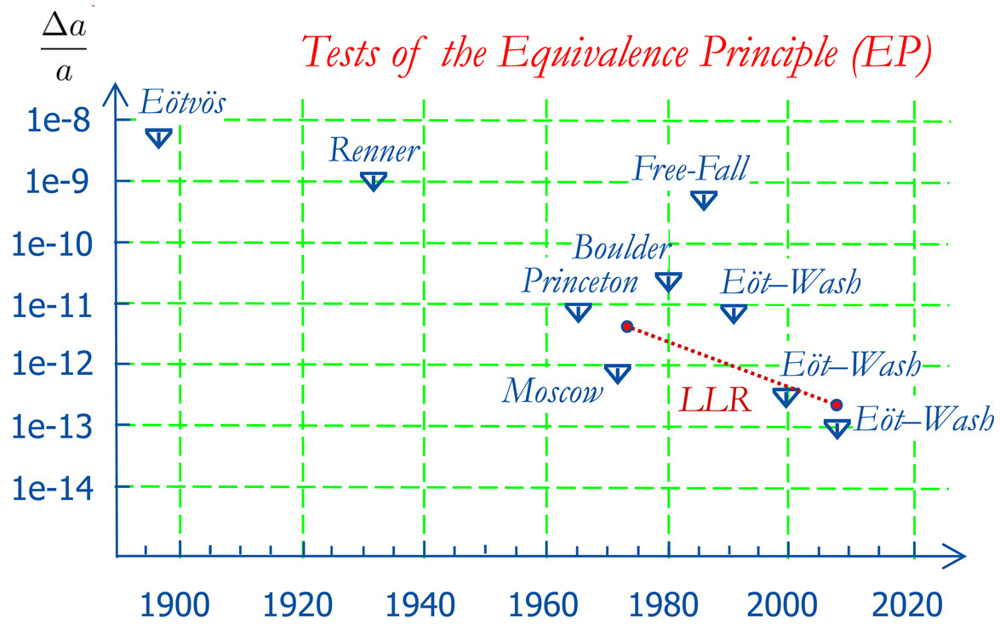
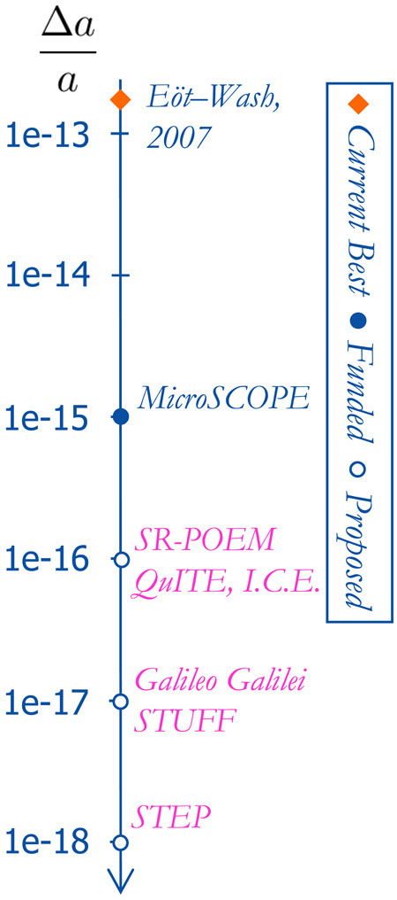
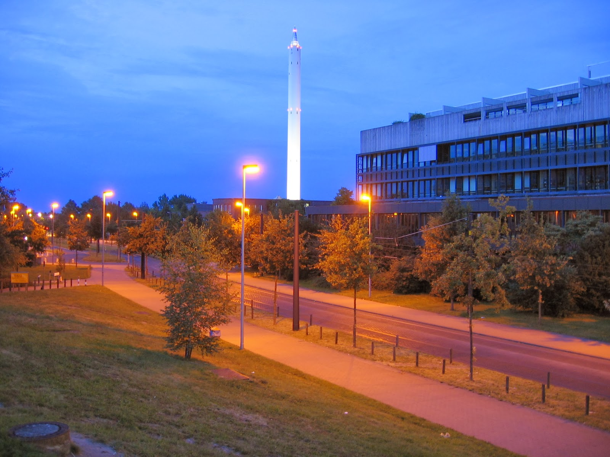

  El Principio de Equivalencia Débil (PED) expresa la universalidad de la aceleración de un cuerpo debido a la interacción gravitacional o, equivalentemente, la igualdad de la masa inercial y la masa gravitacional. Muchos experimentos han sido realizados para testear, cada vez con mayor precisión, esta hipótesis.

 El siguiente gráfico resume los resultados de múltiples experimentos modernos que determinan _cotas máximas_ para las aceleraciones relativas de distintos cuerpos sometidos a la acción de la gravedad, junto con el año en que fueron realizados los experimentos. Esta figura fue extraída del artículo de S.G. Turyshev \[1\]:
  

Fig1: Límites a posibles violaciones del PED.

Además, distintos experimentos están siendo planificados y/o desarrollados con la intención de mejorar las cotas superiores de posibles violaciones del PED. La siguiente figura contiene algunas estimaciones de límites esperados de proyectos experimentales futuros (también de la ref. \[1\]):

## **Referencias**

A continuación un par de papers sobre test experimentales del PED. Note que en \[3\] se reportó por primera vez la verificación del PED para _neutrones_. Más recientemente, se ha puesto a prueba el PED usando interferometría atómica \[4\] y, por primera vez, se ha realizado un experimento para saber si el estado de spín de un átomo afecta o no su caida libre \[5\].

*   \[1\] S.G. Turyshev "_[Experimental Tests of General Relativity: Recent Progress and Future Directions](http://arxiv.org/abs/0809.3730)_". Phys.Usp. **52** (2009) 1-27.
*   \[2\] S.G. Turyshev, "_[Experimental Tests of General Relativity](http://www.annualreviews.org/doi/abs/10.1146/annurev.nucl.58.020807.111839)_", Annu. Rev. Nucl. Part. Sci. **58** (2008) 207-248. Este es un artículo de revisión donde en particular se resumen los tests del PED.
*   \[3\] L. Koester, "_[Verification of the equivalence of gravitational and inertial mass for the](http://prd.aps.org/abstract/PRD/v14/i4/p907_1)_ _[neutron](http://prd.aps.org/abstract/PRD/v14/i4/p907_1)_", Phys. Rev. **D 14** (1976) 907.
*   \[4\] Zhou _et al._, "_[Test of Equivalence Principle at $10^{-8}$ Level by a Dual-Species Double-Diffraction Raman Atom Interferometer](http://dx.doi.org/10.1103/PhysRevLett.115.013004)_", Phys. Rev. Lett. **115** (2015) 013004.
*   \[5\] Duan _et al._, "_[Test of the Universality of Free Fall with Atoms in Different Spin Orientations](http://dx.doi.org/10.1103/PhysRevLett.117.023001)_", Phys. Rev. Lett. **117** (2016) 023001.
*   \[6\] Touboul et al. "[_MICROSCOPE_](https://doi.org/10.1103/PhysRevLett.119.231101) [Mission: First Results of a Space Test of the Equivalence Principle](https://doi.org/10.1103/PhysRevLett.119.231101)". _Physical Review Letters_. **119** (23). 231101. [arXiv](https://en.wikipedia.org/wiki/ArXiv_(identifier) "ArXiv (identifier)"):[1712.01176](https://arxiv.org/abs/1712.01176).

## **Videos/Links**:

*   El famoso [video](https://youtu.be/5C5_dOEyAfk) del astronauta del la misión Apollo 15, soltando un martillo y una pluma, en la luna. Original en sitio de la NASA, [aquí](http://nssdc.gsfc.nasa.gov/planetary/lunar/apollo_15_feather_drop.html):
  

*   Una [versión moderna del mismo experimento](https://youtu.be/cjSvxWpbP_o), realizado en una cámara de vacío (gentileza de [BackStageScience](https://www.youtube.com/channel/UCP16wb-IThCVvM8D-Xx8HXA)). 

*   Otro [video similar](https://youtu.be/E43-CfukEgs), aún más espectacular, por las dimensiones de la cámara de vacío. 
  

*   [ZARM](http://www.zarm.uni-bremen.de/) (Centro para tecnología espacial aplicada y microgravedad), en Bremen, Alemania. Aquí tienen una torre de aproximadamente 110 m, donde se hacen varios experimentos: entre otros de microgravedad y también tests del principio de equivalencia. [Aquí un video](http://www.zarm.uni-bremen.de/drop-tower.html) sobre la torre y la diversión de tirar cosas dentro de ella.

*   Experimento MICROSCOPE ([Página oficial, Wikipedia)](https://en.wikipedia.org/wiki/MICROSCOPE). Experimento satelital para testear el PED, lanzado el año 2016, y decomisionado el 2018. Los resultados fueron publicados el año 2017 en la Ref. \[6\], reportando una cota superior para el parámetro de Eötvös de $10^{-15}$.
